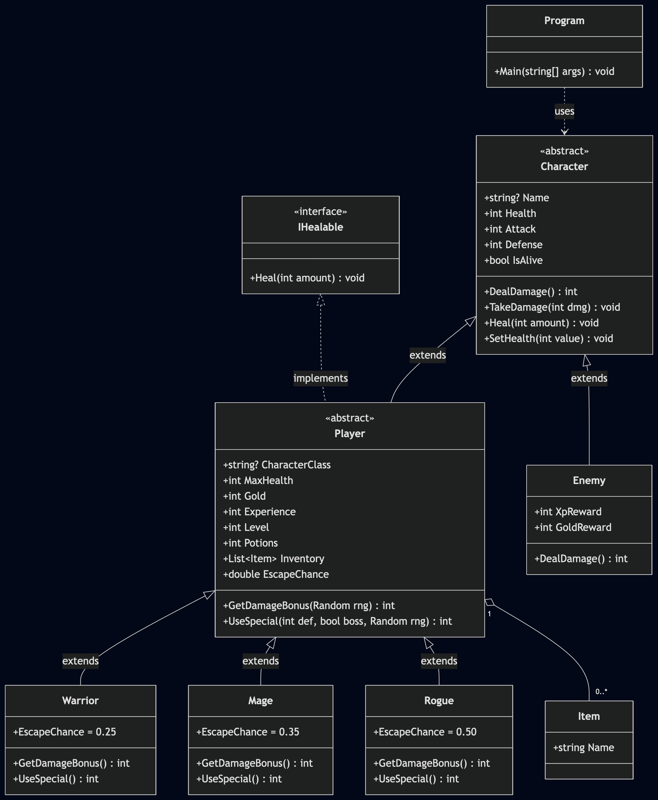

# HeroFight

HeroFight is a text-based RPG game written in C#. You choose a hero class, fight your way through 7 rooms filled with enemies, loot, and merchants, and face a final boss — the Ancient Dragon — to win.

The game was built as a learning project focused on object-oriented programming principles including inheritance, polymorphism, encapsulation, and interfaces.

---

## How to play

Run the game in your terminal:

```bash
dotnet run
```

You will be prompted to enter your name and choose a class. Then fight through 7 rooms using these commands during combat:

| Key | Action |
|-----|--------|
| `A` | Attack the enemy |
| `X` | Use your class special ability |
| `P` | Drink a potion |
| `R` | Try to run away |

Between rooms you can press `C` to continue or `Q` to quit to the main menu.

---

## Classes

| Class   | HP | ATK | DEF | Potions | Gold | Special ability |
|---------|----|-----|-----|---------|------|-----------------|
| Warrior | 40 | 7   | 5   | 2       | 15   | Heavy Strike — high damage, costs 2 HP self damage |
| Mage    | 28 | 10  | 2   | 2       | 15   | Fireball — very high damage, costs 3 gold |
| Rogue   | 32 | 8   | 3   | 3       | 20   | Backstab — 50% chance of massive damage, best escape rate |

---

## Rooms

The adventure consists of 7 rooms in order:

1. Forest Path — enemy combat
2. Old Chest — treasure (gold or item)
3. Travelling Merchant — buy/sell items
4. Cave Entrance — enemy combat
5. Campfire — rest and fully restore HP
6. Cave Depths — enemy combat
7. The Ancient Dragon — final boss

---

## Enemies

| Enemy        | HP | ATK | DEF | XP | Gold |
|--------------|----|-----|-----|----|------|
| Wild Boar    | ~18 | 4  | 1   | 6  | 4    |
| Skeleton     | ~20 | 5  | 2   | 7  | 5    |
| Bandit       | ~16 | 6  | 1   | 8  | 6    |
| Slime        | ~14 | 3  | 0   | 5  | 3    |
| Dark Elf     | ~22 | 7  | 2   | 10 | 8    |
| Ancient Dragon | 55 | 9 | 4   | 30 | 50   |

---

## Built with

- **Language:** C# (.NET 10)
- **Architecture:** Object-oriented programming

**OOP concepts used:**
- **Inheritance** — `Warrior`, `Mage`, `Rogue` extend `Player`, which extends `Character`
- **Polymorphism** — combat code works against the `Character` base class; `DealDamage()`, `UseSpecial()`, and `GetDamageBonus()` call the correct override automatically
- **Encapsulation** — `Health` has a private setter; only changed through `TakeDamage()`, `Heal()`, and `SetHealth()`
- **Interfaces** — `IHealable` defines the healing contract; `Player` implements it
- **Abstraction** — `Character` and `Player` are abstract; you can never create one directly

---

## Class diagram (UML)



---